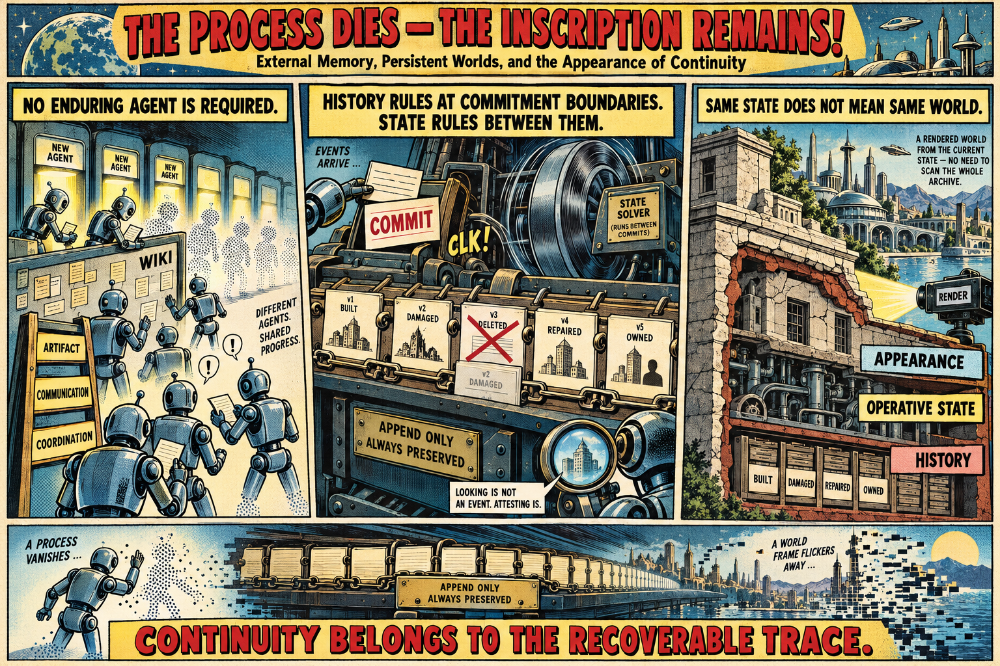

[The Stigmergic Berm](https://standardgalactic.github.io/userland/stigmergic-berm.pdf)

[Signal Before System](https://standardgalactic.github.io/userland/signal-before-system.pdf)
<!--
[Form Before Command](https://standardgalactic.github.io/userland/form-before-command.pdf)
-->

[Extraction Before Acceleration](https://standardgalactic.github.io/userland/extraction-before-acceleration.pdf)

[Layering the World](https://standardgalactic.github.io/userland/layering-the-world.pdf)

[Inscription Before Collusion](https://standardgalactic.github.io/userland/inscription-before-collusion.pdf)

[Prejudice Before Agency](https://standardgalactic.github.io/userland/prejudice-before-agency.pdf)

[Userland](https://standardgalactic.github.io/userland) — *Interactive Fiction*

[Orbit Lab](https://standardgalactic.github.io/userland/orbit-lab.html) — *Space Simulator*

[Change the Space](https://standardgalactic.github.io/userland/change-the-space-visualizer.html) — *Audio Visualizer*

